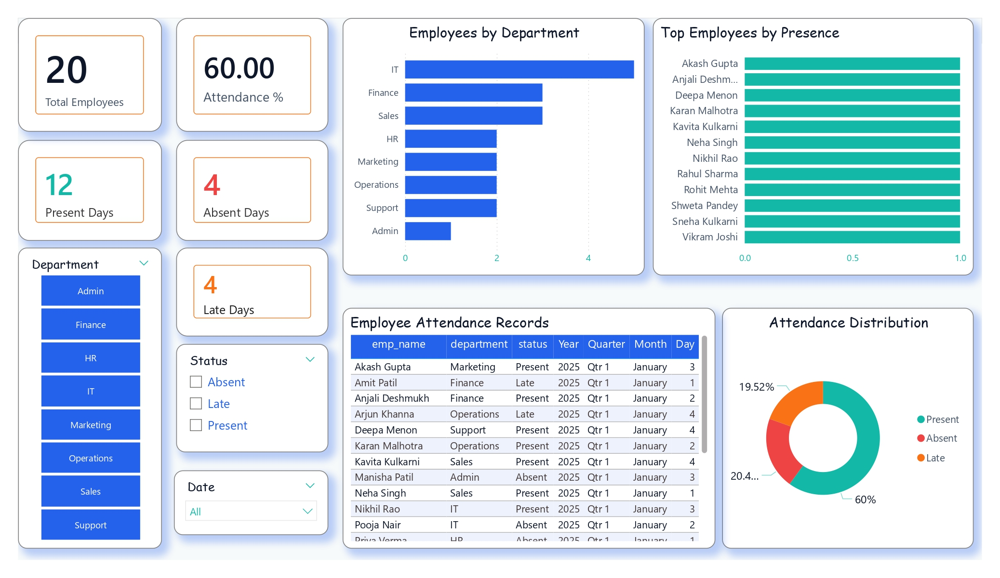

📊 Employee Attendance System | SQL + Power BI

📌 Project Overview
This project is an **Employee Attendance System Dashboard** developed using **SQL and Power BI**.  
The goal of this project is to track, analyze, and visualize employee attendance data to help management understand attendance trends, department-wise presence, and overall workforce behavior.

The project covers the complete data analytics flow:
- Data storage in SQL  
- Data cleaning & transformation  
- Dashboard development in Power BI  

🛠 Tools & Technologies
- **SQL (MySQL / SQL Server)** – Database creation, data insertion, queries  
- **Power BI** – Data modeling, DAX, interactive dashboard  
- **Excel / CSV** – Initial data preparation  

📂 Project Features
- ✅ Total Employees count  
- ✅ Attendance Percentage  
- ✅ Present, Absent & Late days KPIs  
- ✅ Department-wise employee distribution  
- ✅ Top employees by presence  
- ✅ Attendance status distribution  
- ✅ Detailed attendance table  
- ✅ Interactive slicers (Department, Status, Date)  

📸 Dashboard Preview

🗄 Database Structure

**Tables used:**
- Employee  
- Attendance  

Includes:
- emp_id  
- emp_name  
- department  
- status  
- check_in, check_out  
- date fields  

⚙ How this project works

1. Employee attendance data is stored in SQL database  
2. Data is connected to Power BI  
3. Data cleaning & transformation done in Power Query  
4. Measures created using DAX  
5. Interactive dashboard built for analysis  

📈 Key Insights
- Identifies departments with highest attendance  
- Highlights top performing employees  
- Shows attendance trends and distribution  
- Helps HR teams monitor workforce behavior  

📁 Files in this repository
- `Employee Attendance System.pbix` → Power BI dashboard file  
- `attendance.sql` → SQL database script  
- `Dashboard.jpg` → Dashboard screenshot  

👤 Author
**Vedant Dharmale**  
Aspiring Data Analyst  

⭐ If you like this project, give it a star!

